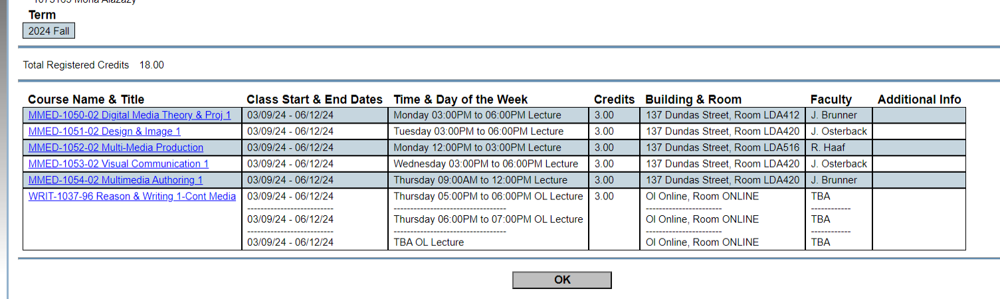

# Markdown
# This is a heading 1
## This is a heading 2
### This is a heading 3

*This is italic*
**This is bold**

This is my body text

unordered list:
- Item 1
- Item 2
      - Item 1 a
      - Tiem 2 a
order list:
1. First item
2. second item

This is a link:
[Google's website](https://www.google.com)

